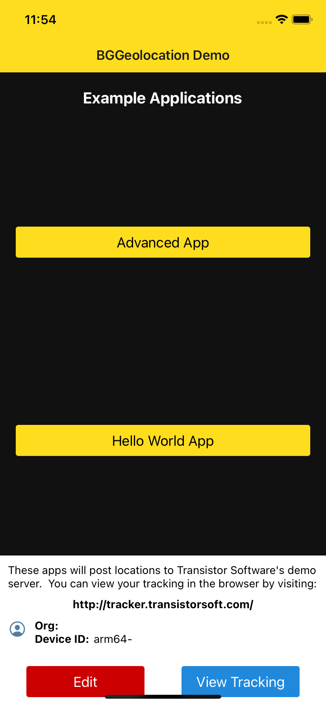
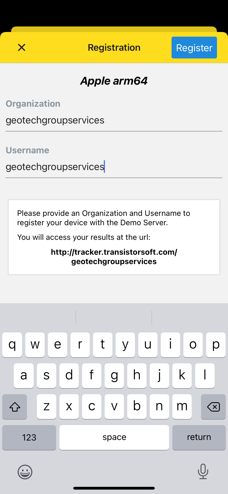
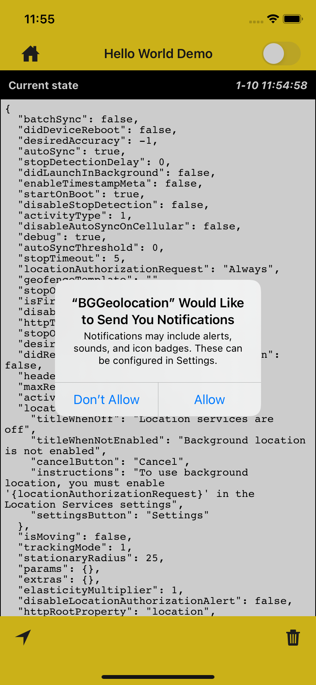
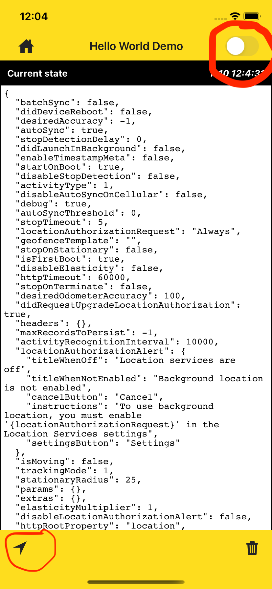
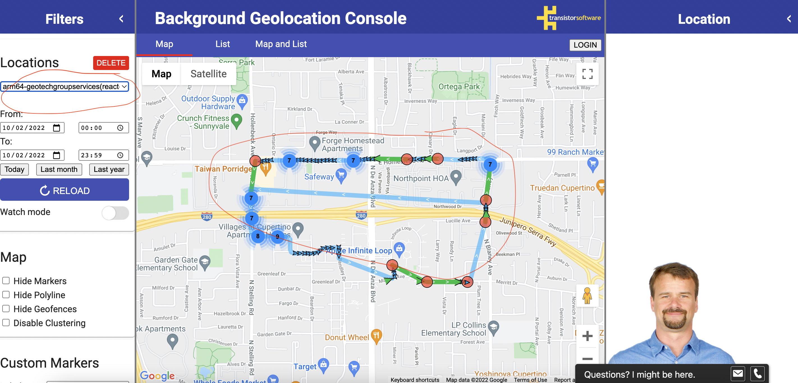

# react-native-geolocation-demo

1. Run the app at the first time.
   

</br>

2. Press "EDIT" and fill like the image below

```
geotechgroupservices
```



=> then press "Register"

</br>

3. Run the Hello App (or Advanced App.)
   => Allow notification

   

4. Make sure we press the "navigation/arrow" icon like google map to request permission.

- We can test when in use app or always. (default:required is always).

  

=> Then toggle the switch on the right of the top bar.

5. Go to this link

[https://tracker.transistorsoft.com/geotechgroupservices](https://tracker.transistorsoft.com/geotechgroupservices)


